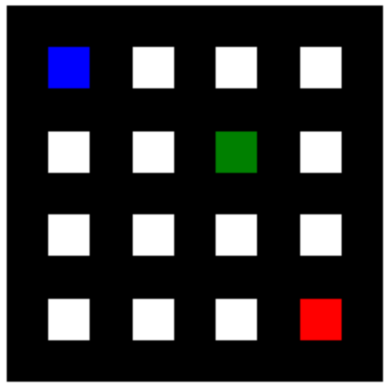

# QDungeonMaps
QDungeonMaps is a small project to generate a random maze based on a Q-learning AI algorithm. The maze will be generated, so that there is a path from the starting point to the treasure, as well as to the end point.

## Deployment and test examples
Install all dependencies using the requirements.txt. As the project is currently very simple, only numpy for calculation and matplotlib for visualization are needed.

Change into the root project folder and for Anaconda use:
```shell
conda install --file requirements.txt
```

or with pip:
```shell
pip install -r requirements.txt
```

To start the test example execute test.py by running
```shell
python3 test.py
```

The main routine in the test program will first reproduce a comparable maze as given in the task description. In that use case the start, treasure and end point are predefined in a fixed position. The AI algorithm will then randomly create a maze around these check points - regarding the above path constraints. The resulting maze is displayed in the first figure with the title "Original technical task description".

Following that, the algorithm will be trained for 100 times to know how many moves are usually needed to create the maze. In comparison to a randomly generated maze (around 30 - 200 moves) the given AI based on Q-learning needs in mean around 30 moves to create the maze.

Lastly the AI will be trained 5 times with random check points (start, treasure, end) and plot the results into "Random example no. [0 ... 5]".

## Basic idea and architecture
### Visualization and representation of maze
To visualize the maze, matplotlib has been used. It generates a 4x4 field matrix with all the walls and corners. Therefore the visualization of a 4x4 field with walls becomes a 9x9 matrix, that is displayed with imshow. Walls/corners are indicated in black, empty cells are indicated in white. At the initial state of the map creation all walls are there and the fields are empty. The check points are displayed in different colors (blue corresponds to the start point, green corresponds to the treasure and red to the end point). It looks like this:


After a successful run of the Q-learning algorithm the map is for example plotted as follows:


### Software concept
The algorithm starts with a per default 4x4 maze where all walls are present (each cell contains 4 walls). The checkpoints "start point", "treasure point" and "end point" are placed on the map either per user definition or by random choice.

Then, the algorithm digs through the maze with a Q-learning agent starting from the start point. When it moves from one cell to another, the wall is removed and the maze is therefore formed gradually. The algorithm can only move from one cell to a neighboring cell. Everthing concerning the maze environment e.g. playable moves, tracking of the current position, checkpoints etc. is handled within QDungeonCore.map_handler. More specifically, each map is an instance of the DungeonMap class.

The Q-learning agent is an instance of the QLearningAgent class from the QDungeonCore.qagent module. It uses an instance of the DungeonMap class at initialization phase. The Q-learning agent can additionally be instantiated with the Q-learning paramters: discount factor gamma, learning rate alpha and a decent, stochastic initalization of the Q_0 matrix. In the main routine of test.py these variables are not explicitly modified, but the default values are set. Of course this can be altered by the user.

The algorithm stops as soon as the treasure and end point have been "discovered" by the agent. As a result the Q-matrix within the Q-learning agent was trained and the maze has been formed during training according to the constraints and maze requirements.

### Q-learning algorithm functionality
For this use case and specific task, the formula for calculating the temporal difference and thus the Q-matrix in each step has been interpreted to fulfill the requirements of the two paths from start to treasure and end. Several assumptions have been made to enhance the algorithm:
* The Q-learning agent should be eager to explore the map, therefore the Q matrix will not be initialized to zero but to a matrix around 1. This idea was taken from https://en.wikipedia.org/wiki/Q-learning#Initial_conditions_(Q0)
* To ensure a certain randomness for the maze generator, additional normal noise with the standard deviation set to 0.1 is given to the initial Q matrix as indicated in the point before
* It should not be attractive to go back the same path or to later cross a dicovered field again. For this reason a penalty of -10 in both of the cases has been introduced. This should encourage the AI to discover new paths.
* It should be rewarded, that the treasure point is found first and second the end point. Therefore there is a single reward for finding the treasure (+10 --> 0) and another for finding the end point (0 --> +10). The classic reward matrix is therefore realized programmatically within the Q-learning agent. This trick avoids the generation of higher dimensions or way more complex matrices for Q, R and helps to virtually portray many more states.

